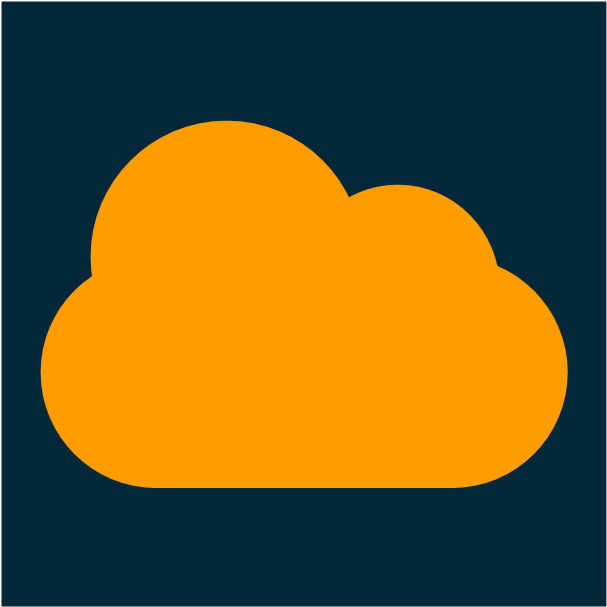
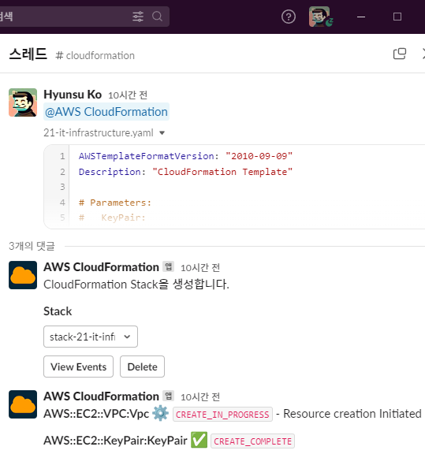

#  AWS-CloudFormation-Slack-App



Create AWS CloudFormation Stack within Slack (*AWS CloudFormation Stack을 Slack에서 생성*)

> [!CAUTION]
> ARM Architecture not supported yet! If you're a ARM(Mac, RaspberryPi ...) user, please try [Cloud9](https://us-east-1.console.aws.amazon.com/cloud9control/home) to deploy your slack app. (ARM 아키텍처는 아직 지원되지 않습니다. Mac, RaspberryPi 등의 ARM 기기를 사용하신다면 [Cloud9](https://us-east-1.console.aws.amazon.com/cloud9control/home)을 활용하여 slack app을 배포하시기 바랍니다.)

<br/>

# Used
- [Slack Bolt for Python](https://github.com/slackapi/bolt-python)
- [AWS CLI](https://aws.amazon.com/ko/cli/)
- [AWS SAMCLI](https://docs.aws.amazon.com/ko_kr/serverless-application-model/latest/developerguide/install-sam-cli.html#install-sam-cli-instructions)
- [Docker](https://docs.docker.com/engine/install/)

<br/>

# Project Structure
```
📦aws-cloudformation-slack-app
 ┣ 📂src
 ┃ ┣ 📂listeners
 ┃ ┃ ┣ 📂handlers
 ┃ ┃ ┃ ┣ 📜create_stack.py
 ┃ ┃ ┃ ┣ 📜delete_stack.py
 ┃ ┃ ┃ ┗ 📜describe_stack_events.py
 ┃ ┃ ┣ 📜actions.py
 ┃ ┃ ┗ 📜events.py
 ┃ ┣ 📜app.py
 ┃ ┗ 📜requirements.txt
 ┣ 📜.gitignore
 ┣ 📜README.md
 ┗ 📜template.yaml
```

<br/>

# Features
@ (app_mention)
  - Call a @Slack_App without text

    *텍스트 없이 @Slack_App을 호출*

    - List Stacks in your Default Region

      *기본 리전 내 Stack 나열*

  - Call a @Slack_App & Upload [Template](https://aws.amazon.com/ko/cloudformation/resources/templates/)

    *@Slack_App을 호출하고 [Template](https://aws.amazon.com/ko/cloudformation/resources/templates/) 업로드*

    - Create a Stack in your Default Region

      *기본 리전에 Stack 생성*

View Events (button)
  - List Events of a Stack you select

    *선택한 Stack의 Event 나열*

Delete (button)
  - Delete Stack you select

    *선택한 Stack을 제거*

<br/>

# Installation

- Lambda Functions and S3 Buckets are needed to deploy a Slack App.
  
  *Slack App 배포를 위해 Lambda 함수와 S3 버킷이 사용됩니다.*

- Charges may apply based on Lambda/S3 usage in your AWS billing.
  
  *Lambda와 S3 사용량에 따라 AWS 요금이 부과될 수 있습니다.*